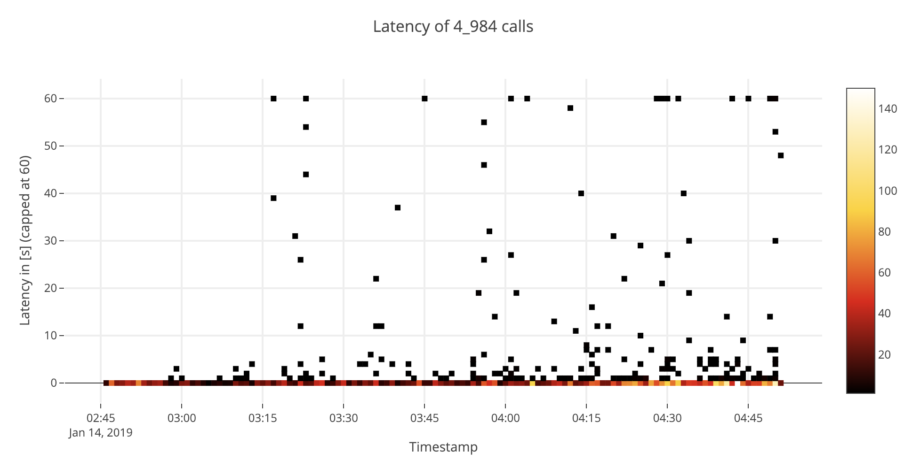
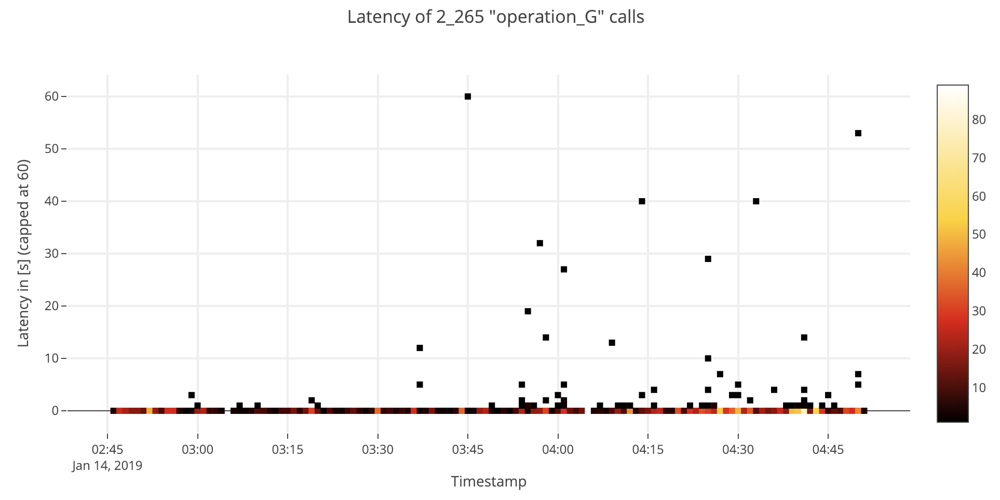

# Request Analysis

Analyse (a custom formated) http-request log for request duration.

Start with `jupyter notebook`.

## Example





## Customizing Analysis

A set of constants allows for some configuration:

```python
# None: all, any other value: just this operation
COMMAND_FILTER=None
#COMMAND_FILTER="operation_G"


# None: all
# Take a sample for visualisation
MAX_ELEMENT_COUNT=None   # I strongly advise against more than 100k elements (performance)

MAX_ELEMENT_COUNT=100_000

# set any outliers that take longer than `PERCENTILE_LIMIT` percent of the calls to this ceiling
# this removes outliers. Will never be higher than DURATION_LIMIT
PERCENTILE_LIMIT=0.999
DURATION_LIMIT=60  # unit: the same unit as used in the data files

# https://pandas.pydata.org/pandas-docs/stable/timeseries.html#timeseries-offset-aliases
ROUND_TO="15min"
#ROUND_TO="6H"
#ROUND_TO="1min"

# The unit of the duration column - only used in labeling charts
DURATION_UNIT = "s"

_DATASET_SMALL="example_dataset.txt"
_DATASET_LARGE="../combined-sorted.txt"

DATASET=_DATASET_SMALL
```

## Data format

The example dataset is split into the following columns:

| Name | format | description |
|---|---|---|
| Timestamp  | timestamp  | Occurence of the request  |
| URL  | string | URL of the request (ignored!)  |
| command  | string  | The command executed. This is the grouping criteria for analysis.  |
| duration  | int  | Duration  of the request.  |

```csv
14/Jan/2019:03:46:03 /example/url operation_G 0
14/Jan/2019:03:46:07 /example/url operation_G 0
14/Jan/2019:03:46:07 /example/url operation_G 2
14/Jan/2019:03:46:08 /example/url operation_G 0
14/Jan/2019:03:46:09 /example/url operation_G 0
14/Jan/2019:03:46:10 /example/url operation_B 5
14/Jan/2019:03:46:19 /example/url operation_A 0
14/Jan/2019:03:46:19 /example/url operation_F 90
14/Jan/2019:03:46:20 /example/url operation_E 9
14/Jan/2019:03:46:24 /example/url operation_F 0
```

### Modifying the data format

Look for where the dataset is read and where it is converted (parsing of the timestamp).

# Installation

`pip3 install scipy plotly pandas matplotlib seaborn`


